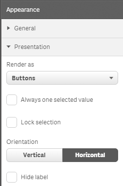

# Simple List component for Qlik Sense

Simple List component for Qlik Sense (under development).

Features:
- rendering options (buttons, radio buttons, checkboxes, switch, select);
- always one selected value;
- lock selection

Constraints:
- no more than 1000 items can be shown.

## Configuration

## Maintainers

[alner](https://github.com/alner)
[dligthart](https://github.com/dligthart)

## License

MIT
